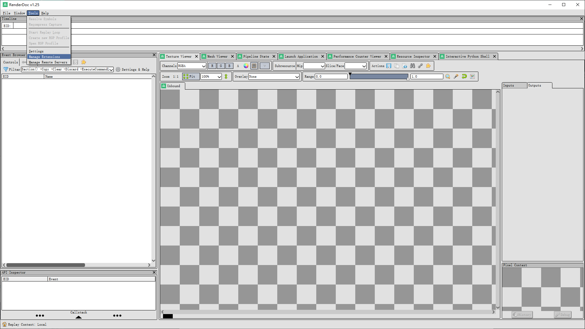
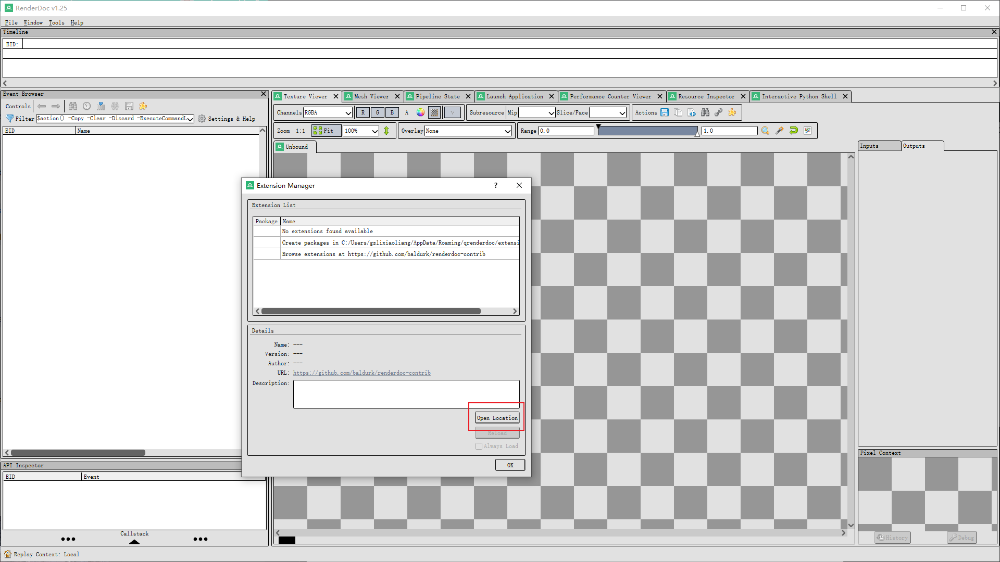
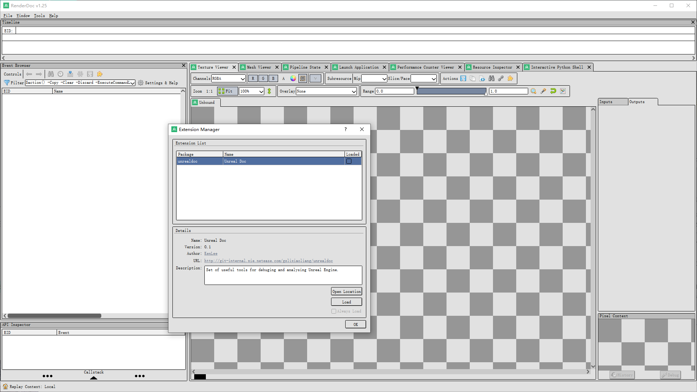
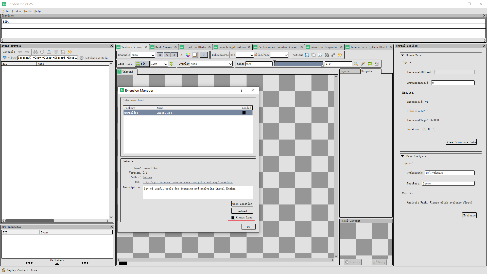

## Usage

### Enable the extension

1. Open Renderdoc. Goto 【Tools】- 【Manage Extensions】

   

   

2. Click 【Open Location】. This would lead you to the plug-in folder that renderdoc reads.

   

   

3. Open a terminal in that plug-in folder. Clone the repo with `--recurse-submodules` parameter.

   ```bash
   > git clone --recurse-submodules ssh://git@git-internal.nie.netease.com:32200/gzlixiaoliang/unrealdoc.git
   ```

   

4. Reopen the Extension Manager by step 1 && 2. You will see a new extension is added.

   

   

5. Click 【Load】 and check 【Always Load】.  You can see the 【Unreal Toolbox】shows.

   

   

### Scene Data Tool


### Pass Analysis Tool


### Mesh Draw Call Analysis Tool


## Write Your Own Tool

### Develop Environment and Debugging


### Main Workflow of a Tool

#### User Interface


#### Render Resource Data Acquisition

